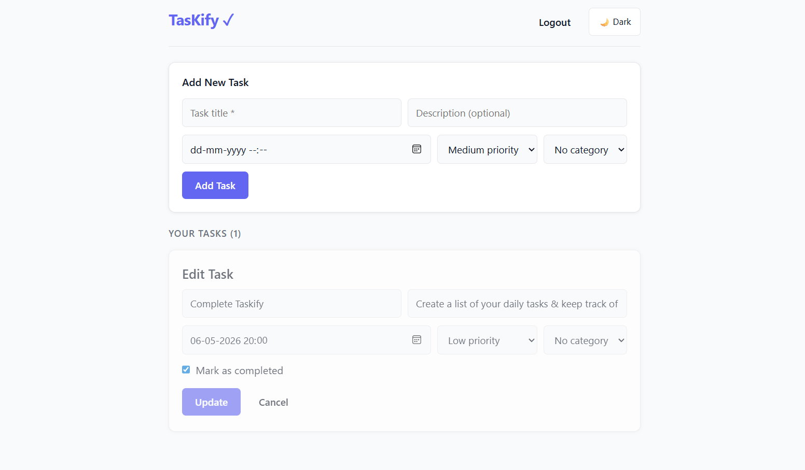
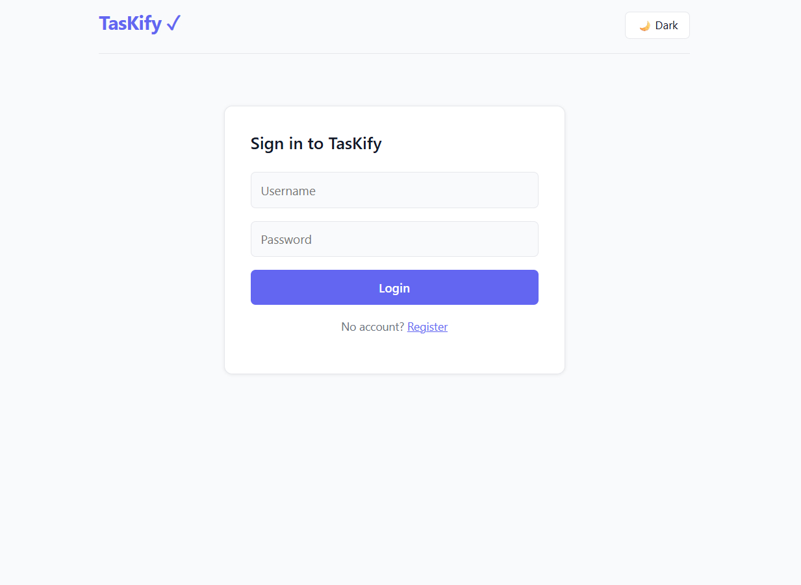
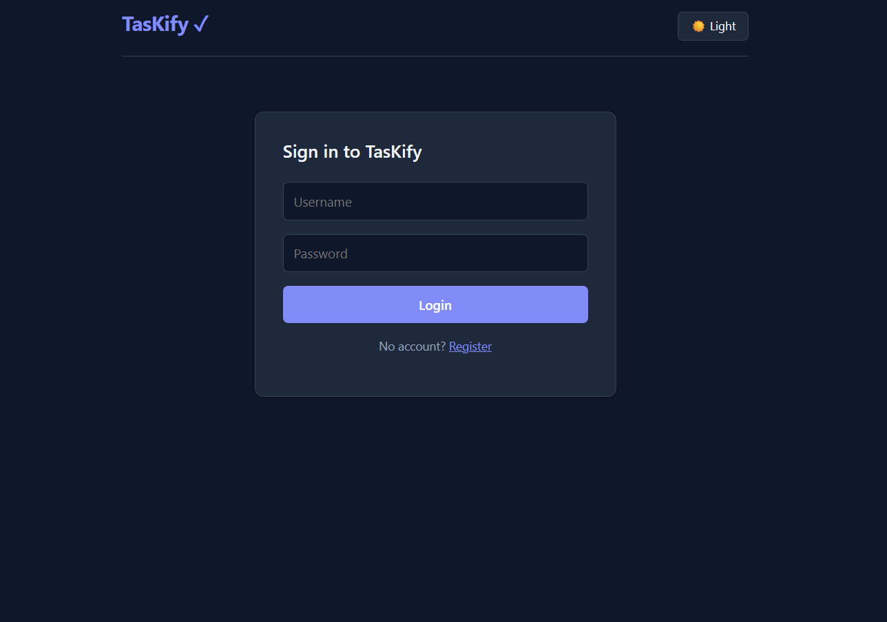

# TasKify ✓

> A full-stack task management app — organize your day, your way.



---

## 📸 Screenshots

| Light Theme
|  

| Dark Theme |
|  

---

## ✨ Features

| Feature | Description |
|---------|-------------|
| 🔐 User Authentication | Register and login with JWT-secured sessions |
| ✅ Full Task CRUD | Create, edit, complete and delete tasks |
| ⏰ Deadlines & Reminders | Set due dates with automatic overdue detection |
| 🏷 Categories & Labels | Organize tasks with custom color-coded labels |
| 🌙 Dark / Light Mode | Toggle between themes, preference is saved |
| 📱 Responsive Design | Works cleanly on desktop, tablet and mobile |

---

## 🛠️ Tech Stack

### Backend


| Technology | Purpose |
|------------|---------|
| FastAPI | REST API framework |
| SQLAlchemy | Database ORM |
| Pydantic | Data validation and schemas |
| python-jose | JWT token creation and validation |
| passlib + bcrypt | Password hashing |
| SQLite | Database (dev) |

### Frontend


| Technology | Purpose |
|------------|---------|
| React | UI framework |
| React Router | Client-side routing |
| Axios | HTTP requests with JWT interceptor |
| CSS Variables | Theming and dark mode |

---

## 📁 Project Structure

```
TasKify_App/
├── backend/
│   ├── main.py          # App entry point, CORS, router registration
│   ├── crud.py          # All routes, schemas, JWT auth logic
│   ├── models.py        # SQLAlchemy models (User, Category, ToDo)
│   ├── database.py      # DB engine and session setup
│   ├── requirements.txt
│   └── .env             # Secret key
└── frontend/
    └── src/
        ├── App.js           # Routing, theme toggle, auth state
        ├── App.css          # Component styles
        ├── index.css        # Global reset and CSS theme variables
        └── components/
            ├── Login.js     # Sign in page
            ├── Register.js  # Sign up page
            ├── ToDoList.js  # Main task dashboard
            ├── ToDoForm.js  # Add task form
            └── ToDoEdit.js  # Inline edit form
```

---

## 🚀 Getting Started

### Prerequisites

- Python 3.10+
- Node.js 18+
- npm

---

### 1. Clone the repository

```bash
git clone https://github.com/YOUR_USERNAME/TasKify_App.git
cd TasKify_App
```

---

### 2. Backend Setup

```bash
cd backend

# Create and activate virtual environment
python -m venv venv

# Windows
venv\Scripts\activate
# Mac / Linux
source venv/bin/activate

# Install dependencies
pip install -r requirements.txt
```

Create a `.env` file inside the `backend/` folder:

```bash
# backend/.env
SECRET_KEY=your-random-secret-key-here
```

Start the server:

```bash
uvicorn main:app --reload
```

✅ Backend runs at `http://localhost:8000`
📖 API docs available at `http://localhost:8000/docs`

---

### 3. Frontend Setup

```bash
cd frontend
npm install
npm start
```

✅ Frontend runs at `http://localhost:3000`

---

## 🔮 Upcoming Improvements

- [ ] Email reminders for deadlines
- [ ] Drag and drop task reordering
- [ ] Task search and filtering
- [ ] PostgreSQL support for production
- [ ] Deploy

---

## 📄 License

This project is licensed under the [MIT License](LICENSE).

---

## 🙋‍♂️ Author

**Sahil**

*Built with ❤️ using FastAPI and React*
